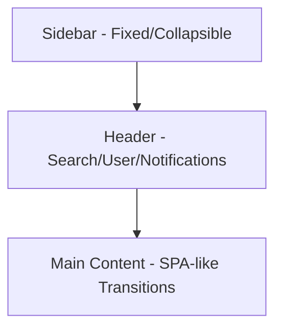

# 📄 ERP SYSTEM SPECIFICATION (ANTIGRAVITY)
## 🏭 Hệ thống Quản trị Sản xuất – Bán hàng – Kho (Unified ERP)

---

# 1. 🧭 Tổng quan & Tầm nhìn UI/UX

Hệ thống phục vụ quản lý nội bộ với phong cách **Futuristic & Minimalist**, mang lại trải nghiệm "không trọng lực" (Antigravity) với hiệu năng cực cao và thao tác tối giản.

### 🎯 Mục tiêu ban đầu:
- Đồng bộ dữ liệu giữa các bộ phận (Sales, Production, Warehouse).
- Tự động hóa quy trình (Đặt hàng → Sản xuất → Kho → Doanh thu).
- Theo dõi hiệu suất nhân viên & giảm thao tác thủ công.

### 🔑 Triết lý thiết kế mới:
- **Dashboard-centric**: Mọi luồng công việc bắt đầu từ Dashboard. Nhìn 5 giây là hiểu tình hình.
- **Workflow-driven**: Giảm click tối đa, dẫn dắt người dùng qua các bước tự động.
- **Role-based UI**: Giao diện thay đổi linh hoạt theo vai trò (Sales, Production, Warehouse, Admin).
- **Action-first**: Nút hành động (CTA) luôn rõ ràng và dễ tiếp cận.

---

# 2. ⚙️ Kiến trúc Công nghệ (Tech Stack)

Quyết định sử dụng Stack hiện đại nhất để đảm bảo tính Real-time và Hiệu năng:

- **Framework**: **Laravel 11/12 + Livewire 3** (Full reactivity, no page reload).
- **Interactivity**: Alpine.js (Lightweight) & Framer Motion (Transitions).
- **Styling**: Tailwind CSS (Utility-first, Glassmorphism effects).
- **Database**: PostgreSQL / MySQL.
- **Real-time**: Laravel Echo + Pusher/Soketi cho thông báo & cập nhật trạng thái tức thì.
- **Icons**: Lucide Icons / Phosphor Icons.

---

# 3. 🖥️ Layout Tổng thể (Standard CRM Layout)

### 📌 3.1 Sidebar (Menu điều hướng)
- **Menu chính**: Dashboard, Thông báo, Sản phẩm, Bán hàng, Sản xuất, Kho, Nhân viên.
- **UX**: Highlight menu active, hỗ trợ thu gọn (Collapse), icon trực quan.

### 📌 3.2 Header
- **🔍 Global Search**: Tìm nhanh mọi thứ (Đơn hàng, KH, Sản phẩm) bằng phím tắt `/`.
- **🔔 Notification**: Chông thông báo với Badge đỏ 🔴, cập nhật real-time.
- **👤 User Profile**: Avatar, Settings, Chuyển nhanh vai trò (nếu là Admin).

---

# 4. 🔔 Module THÔNG BÁO & NỘI QUY

- **Nội dung**: Nội quy công ty, thông báo từ ban lãnh đạo.
- **Lịch làm việc**: Hiển thị dạng **Gantt Chart** trực quan cho toàn bộ máy.
- **Hành chính**: Form xin nghỉ / xin phép trực tuyến.
- **UX nâng cao**: Thông báo mới đẩy trực tiếp qua **Toast message** (Real-time).

---

# 5. 📦 Module THÔNG TIN SẢN PHẨM

- **Dữ liệu**: Tên sản phẩm, SKU, Mô tả chi tiết, Chú thích kỹ thuật.
- **Quản lý**: Danh sách tối giản, hỗ trợ xem nhanh (Quick View) thông số.

---

# 6. 💰 Module BÁN HÀNG (Sales Workflow)

### 📌 Form đặt hàng:
- **Thông tin**: Tên khách hàng, **Mã số thuế (MST)**, Sản phẩm, Số lượng.
- **UX**: Auto-complete thông tin KH, **Real-time Inventory Check** (cảnh báo ngay lập tức nếu thiếu hàng).

### 📌 Quản lý đơn hàng:
- **Table Integration**: Hỗ trợ Sort, Filter, Search cực nhanh.
- **Right Drawer UX**: Click vào một dòng sẽ mở Drawer bên phải để xem chi tiết hoặc chỉnh sửa nhanh mà không cần chuyển trang.
- **Trạng thái màu sắc**:
    - 🟡 **Pending**: Chờ xác nhận.
    - 🔵 **Processing**: Đang xử lý.
    - 🟢 **Done**: Hoàn thành.
- **Logic**: Đủ tồn kho → trừ kho, cộng trực tiếp doanh thu cho User thực hiện.

---

# 7. 🏭 Module SẢN XUẤT (Production Automation)

Sử dụng mô hình **Kanban Board** kết hợp luồng báo cáo:

### 📌 Kanban Workflow:
`[Chờ xử lý] ➔ [Đang thực hiện] ➔ [QC/Kiểm tra] ➔ [Hoàn thành]`
- **UX**: Mỗi card là một lệnh sản xuất. Hỗ trợ **Drag & Drop** để chuyển trạng thái real-time.

### 📌 Chức năng chi tiết:
- **Đề xuất NVL**: Tự động tính toán mẫu nguyên vật liệu cần dùng dựa trên lệnh đặt hàng.
- **Lệnh sản xuất**: Giao việc cho nhân viên, deadline, theo dõi tiến độ theo %.
- **Hệ thống báo cáo**: Báo cáo sản xuất hằng ngày, báo cáo đóng gói chi tiết.

---

# 8. 📦 Module KHO (Smart Inventory)

- **Quản lý tồn kho**: Tồn kho cập nhật Real-time.
- **Color Coding**: 🔴 Đỏ (Sắp hết), 🟡 Vàng (Cảnh báo), 🟢 Xanh (Ổn định).
- **Giao dịch**: Nhập kho, Xuất kho (Hỗ trợ quét QR/Barcode).
- **Stock Movement Timeline**: Lịch sử nhập/xuất được hiển thị dạng Timeline trực quan.

---

# 9. 👨‍💼 Module NHÂN VIÊN & PHÂN QUYỀN (RBAC)

- **Dữ liệu**: Mã NV, Avatar, Tên, Vai trò (Role), KPI cá nhân.
- **Role-based UI Logic**:
    - **Sales**: Thấy Module Bán hàng & Khách hàng.
    - **Production**: Thấy Kanban và Báo cáo sản xuất.
    - **Warehouse**: Thấy Kho và Stock movement.
    - **Admin**: Quyền truy cập toàn hệ thống + Dashboard tổng hợp.
- **Audit Log**: Timeline lịch sử hoạt động của từng nhân viên để truy vết lỗi logic.

---

# 10. 🎨 Design System (Antigravity Style)

2. **Global Notifications**: Toast messages cực mượt khi có cập nhật mới.
3. **Keyboard Shortcuts**:
    - `N`: Tạo đơn hàng mới.
    - `/`: Focus vào ô Search.
    - `Esc`: Đóng Modal/Drawer.
4. **Quick Actions**: Hover vào row hiện nhanh nút Edit/Delete.

---

# 11. 🧱 Cấu trúc Database (Core Tables)

- `users`: ID, Name, Role, Preferences.
- `products`: Name, SKU, Category, Base Price.
- `orders`: Customer, Status, Total, Timeline.
- `production_orders`: Order ID, Status, Assigned To, Progress.
- `inventory`: Product ID, Quantity, Threshold, Location.
- `stock_movements`: Product ID, Type (In/Out), Quantity, Note.
